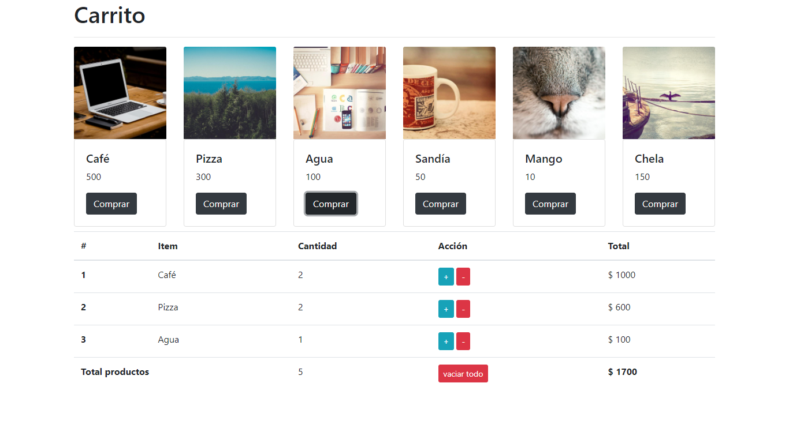

# shopping-cart

Este repositorio almacena una App Web para la gestión de un carrito de compra.

## Detalles de la implementación
Para el desarrollo de la App se utilizaron las siguientes tecnologías:
* Bootstrap 4 como framework de HTML y CSS.
* JavaScript vanilla.

## Despliegue
- netlify - [Shopping Cart](https://loving-brown-4cca60.netlify.app/)